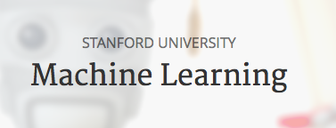
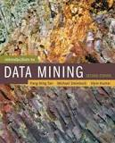
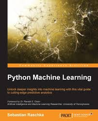
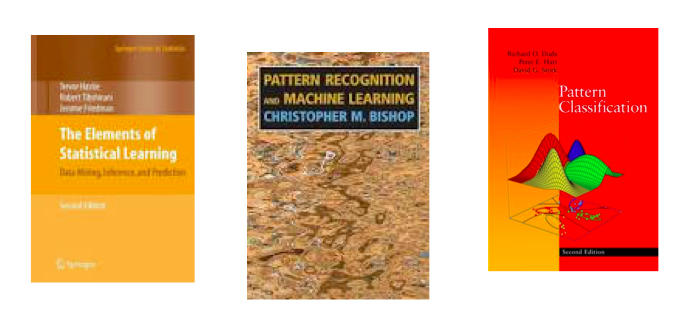
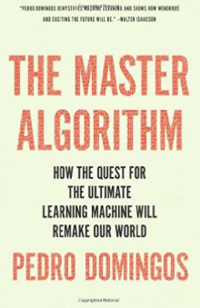

# How would your curriculum for a machine learning beginner look like?
If I had to put together a study plan for a beginner, I would probably start with an easy-going intro course such as

- Andrew Ng's [Machine Learning course on Coursera](https://class.coursera.org/ml-005/lecture)

Next, I would recommend a good intro book on 'Data Mining' (data mining is essentially about extracting knowledge from data, mainly using machine learning algorithms). I can highly recommend the following book written by one of my former professors:

- P.-N. Tan, M. Steinbach, and V. Kumar. [Introduction to Data Mining](http://www-users.cs.umn.edu/~kumar/dmbook/index.php), (First Edition). Addison-Wesley Longman Publishing Co., Inc., Boston, MA, USA, 2005.

This book will provide you with a great overview of what's currently out there; you will not only learn about different machine learning techniques, but also learn how to "understand" and "handle" and interpret data -- remember; without "good," informative data, a machine learning algorithm is practically worthless. Additionally, you will learn about alternative techniques since machine learning is not always the only and best solution to a problem

> if all you have is a hammer, everything looks like a nail ...

Now, After completing the Coursera course, you will have a basic understanding of ML and broadened your understanding via the Data Mining book.
I don't want to self-advertise here, but I think my book would be a good follow-up to learn ML in more depth, understand the algorithms, learn about different data processing pipelines and evaluation techniques, best practices, and learn how to put in into action using Python, NumPy, scikit-learn, and Theano so that you can start working on your personal projects.

While you work on your individual projects, I would maybe deepen your (statistical learning) knowledge via one of the three below:

- T. Hastie, R. Tibshirani, J. Friedman, T. Hastie, J. Friedman, and R. Tibshirani. [The Elements of Statistical Learning](http://statweb.stanford.edu/~tibs/ElemStatLearn/), volume 2. Springer, 2009.
- C. M. Bishop et al. [Pattern recognition and machine learning](http://www.springer.com/us/book/9780387310732), volume 1. springer New York, 2006.
- Duda, Richard O., Peter E. Hart, and David G. Stork. [Pattern classification](http://www.wiley.com/WileyCDA/WileyTitle/productCd-0471056693.html). John Wiley & Sons, 2012.

When you are through all of that and still hungry to learn more, I recommend

- [the Deep Learning book](http://www.iro.umontreal.ca/~bengioy/dlbook/) by Yoshua Bengio, Ian Goodfellow, and Aaron Courville. The release date is set around 2016, but the 613-page manuscript is already available as as of today (online and for free).

- And in-between, if you are looking for a less technical yet very inspirational free-time read, I highly recommend [Pedro Domingo's The Master Algorithm: How the Quest for the Ultimate Learning Machine Will Remake Our World](https://homes.cs.washington.edu/~pedrod/)

   
